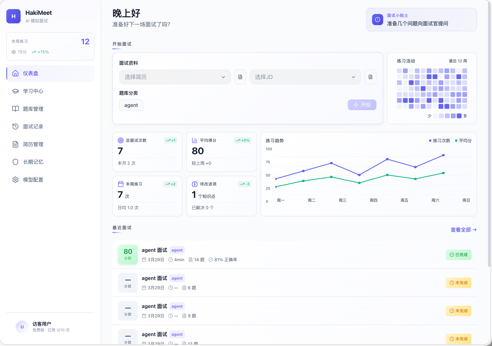

# HakiMeet

HakiMeet 是一个 AI 模拟面试平台，支持语音面试、题库检索、简历追问、面试报告和长期记忆，适合做日常面试练习与复盘。

## 界面预览

### 首页



首页把开始面试、练习趋势、最近记录和长期记忆入口放在同一页，适合快速进入下一轮练习。

### 面试过程


面试页提供数字人面试官、实时对话区、计时状态和暂停/结束控制，整体流程更接近真实口语面试。

## 核心能力

- 实时语音面试：基于豆包语音能力完成提问、追问和点评。
- 题库增强：支持上传 Markdown 或 PDF 题库，结合 RAG 做更贴近岗位的提问。
- 简历追问：上传简历后，面试官会围绕项目经历继续深挖。
- 结果复盘：面试结束后生成评分和改进建议。
- 长期记忆：记录薄弱点，在后续练习中持续追问。
- 模型配置：文本模型和语音模型密钥都可以在页面中配置。

## 技术栈

- 前端：Vue 3、Vite、Pinia、Tailwind CSS、Three.js
- 后端：FastAPI、SQLAlchemy、ChromaDB、LangChain
- AI：豆包文本模型、豆包语音模型
- 存储：SQLite、ChromaDB

## 快速开始

### Docker

```bash
docker compose up -d --build
```

启动后可访问：

- 前端：`http://localhost`
- 后端 API：`http://localhost:8000/docs`

停止服务：

```bash
docker compose down
```

### 本地开发

后端：

```bash
cd backend
uv venv .venv
source .venv/bin/activate
uv pip install -r requirements.txt
python run.py
```

前端：

```bash
cd frontend
pnpm install
pnpm dev
```

前端默认运行在 `http://localhost:5173`，并代理后端接口。

## 配置说明

应用级环境变量只保留少量基础配置，例如：

| 变量 | 说明 | 默认值 |
| --- | --- | --- |
| `SECRET_KEY` | JWT 签名密钥 | `dev-secret-change-in-production` |
| `DATABASE_URL` | 数据库连接字符串 | `sqlite+aiosqlite:///./hakimeet.db` |

模型相关密钥不写入 `.env`，统一在应用内的 `/settings` 页面配置。

## 使用流程

1. 上传简历或题库。
2. 在首页选择简历、题库和分类。
3. 开始语音面试并完成问答。
4. 查看评分报告和长期记忆，继续下一轮练习。

## 项目结构

```text
HakiMeet/
├── backend/        # FastAPI、RAG、语音与数据层
├── frontend/       # Vue 3 前端界面
├── resources/      # README 使用的界面截图
├── docker-compose.yml
└── README.md
```

## License

MIT
